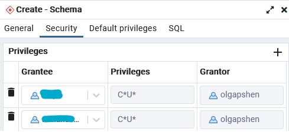

## NorthGateSwarm

Здесь содержатся все необходимые файлы для разворачивания инфрастрктуры

> TODO: скорее всего перенести в `Wiki` проекта

Директории:

- [backend](backend/) конфигурация `Docker` стека `backend`-а
- [frontend](frontend/) конфигурация `Docker` стека `frontend`-а
- [postgres](postgres/) конфигурация `Docker` стека для базы данных
- [nifi](nifi/) конфигурация `Docker` стека `Nifi`
- [nginx](nginx/) конфигурация `Docker` стека центрального прокси

> TODO: подумать над тем, стоит ли все сервисы объединить в один стек,
> папки при этом можно оставить. В каждой папке будет свой Dockerfile
> но docker-compose.yml будет один

## Содержание

- [NorthGateSwarm](#northgateswarm)
- [Содержание](#содержание)
- [Хостинг](#хостинг)
  - [DNS](#dns)
  - [Firewall](#firewall)
- [Система](#система)
  - [Файловая система](#файловая-система)
  - [Сеть](#сеть)
  - [Сертификаты](#сертификаты)
- [Приложение](#приложение)
  - [Инициализация](#инициализация)
  - [Секреты](#секреты)
- [Основной стек](#основной-стек)
  - [Fronend](#fronend)
  - [Backend](#backend)
  - [База данных](#база-данных)
    - [NextGIS](#nextgis)
  - [Nginx](#nginx)
- [Стек Nifi](#стек-nifi)
  - [Nifi](#nifi)
  - [Сертификаты](#сертификаты-1)
  - [Настройка Nifi](#настройка-nifi)
  - [Настройка Nifi Registry](#настройка-nifi-registry)
- [Развёрстка](#развёрстка)

> TODO: интегрировать репозитории `frontend`-а и `backend`-а в образы целевых
> `Dockerfile`-ов и настроить `CI` для автогенерации контейнера вокруг
> исходников. Скорее всего будет целесообразно раскидать `Dockerfile`-ы
> привязанные к целевым репозитриям по этим репозиториям, тем самым
> облегчив настройку `CI`. В данном репозитории (`Swarm`) останутся только те
> `Dockerfile`-ы для которых нет отдельного репозитория, так же останется
> конфигурация стеков, или же одного стека в виде единого
> `docker-compose.yml`. Файлы стеков будут тянуть образы целевых проектов из
> репозитория образов на `GitHub`-е, куда эти образы, как было сказано выше
> будут попадать по средствам системы `CI` из сборки самих целевых проектов.

## Хостинг

Документация по конфигурации хостинга располагающегося в [облаке][1] `VK`.

### DNS

Конфигурация `NS` зоны происходит на уровне настроек [хостинга][2].
Ниже приведены основные настройки `DNS`:

| Тип   | Имя                          | TTL, сек | Значение            |
| :---- | :--------------------------- | :------- | :------------------ |
| A     | @                            | 86400    | 89.208.199.85       |
| CNAME | api.northgatevologda.ru      | 86400    | northgatevologda.ru |
| CNAME | db.northgatevologda.ru       | 86400    | northgatevologda.ru |
| CNAME | nifi.northgatevologda.ru     | 86400    | northgatevologda.ru |
| CNAME | pgadmin.northgatevologda.ru  | 86400    | northgatevologda.ru |
| CNAME | registry.northgatevologda.ru | 86400    | northgatevologda.ru |
| NS    | @                            | 86400    | ns1.mcs.mail.ru     |
| NS    | @                            | 86400    | ns2.mcs.mail.ru     |

### Firewall

Блокировка сетевых портов так же происходит на уровне [хостинга][3]. Ниже
приведены основные согласованные порты и их обычный статус. Все остальные
порты должны быть закрыты.

| Порт  | Сервис          | Открыт |
| :---- | :-------------- | :----- |
| 443   |                 | +      |
| 5432  | `Postgres`      | +      |
| 8443  | `Nifi`          | +      |
| 18080 | `Nifi Registry` |        |

Порт `443` является основным портом внешнего взаимодействия. Сервисы которые
не работают по `TLS` проксируются через `Nginx` по порту `443`.

Порт `18080`, это порт интерфейса `Nifi Registry`. В связи с отсутствием
*коммерческих* сертификатов нам пока не удалось поднять `Nifi Registry` с
активной системой аутентификации. Как решение проблемы, мы блокируем порт
интерфейса Реестра `Nifi` в обычном режиме и открываем его в случае
надобности. На уровне хоста `Nifi` и `Nifi Registry` взаимодействуют без
каих либо ограничений.

## Система

Далее документация по настройкам и взаимодействию с операционной системой.

### Файловая система

На сервере есть ряд важных папок в файловой системе `/opt`:

| Папка      | Назначение                   |
| :--------- | :--------------------------- |
| `frontend` | Репозиторий клиентской части |
| `backend`  | Репозиторий `Backend`-а      |
| `nifi`     | Папка `Nifi`                 |
| `certs`    | Папка с сертификатами        |

### Сеть

Основные сервисы работают в сети `northgatevologda`. Два сервиса `Nifi`:
`Nifi` и `Nifi Registry` работают через сеть `nifi`. Обе создаются в рамках
инициализации инфраструктуры. Процесс описан ниже.

Сеть `northgatevologda` имеет тип `overlay` и служит абстракцией для
взаимодействия узлов в *Улье* `Docker`-а не привязываясь к данному хосту.

Сеть `nnifi` имеет тип `bridge` и настроена для объединения двух контейнеров
экосистемы `nifi` в одну локальную сеть привязанную к данному хосту.

Я заметила что при подключении обычного контейнера `Docker`-а к сети типа
`overlay` могут возникнуть проблемы.

Для вывода прослушиваемых портов используйте команду:

```sh
sudo ss -tln
```

> TODO: Описать разницу между форматом `*:*` и `[::]:*`

### Сертификаты

> TODO: в случае если получится интегрировать сертификаты `letsencrypt` с
> `Nifi`? вернуть интеграцию с `certbot` и заполнить главу актуальной
> информацией; если нет то полностью отказаться от `letsencrypt` и `certbot`;
> Так же описать скрипт `generate-ssl.sh`

На данный момент ответственные коллеги создали для нас следующие сертификаты.
Сертификаты создали с помощью систем `letsencrypt` и `certsbot`.

* `northgatevologda.ru.pem`
* `northgatevologda.ru.pri.pem`
* `api.northgatevologda.ru.pem`
* `api.northgatevologda.ru.pri.pem`
* `db.northgatevologda.ru.pem`
* `db.northgatevologda.ru.pri.pem`
* `nifi.northgatevologda.ru.pem`
* `nifi.northgatevologda.ru.pri.pem`
* `pgadmin.northgatevologda.ru.pem`
* `pgadmin.northgatevologda.ru.pri.pem`

Ключи сертификатов храняться в *Хранилище*. Важная информация: `PEM` это
`Base64` версия `DER`. Личные ключи сертификатов закодированы алгоритмом
`EC`, а не `RSA`. На сервере все ключи и сертификаты хранятся в папке
`/opt/certs`. Каждый набор файлов хранится в папке с именем домена
сертификата. В каждой папке домена есть набор файлов, но важны нам лишь
некоторые:

| Файл            | Описание                            |
| :-------------- | :---------------------------------- |
| `privkey.pem`   | Приветный ключ                      |
| `chain.pem`     | Корневые и промежуточные сертифкаты |
| `fullchain.pem` | Полная цепочка сертификатов         |

Немного о `fullchain.pem`. Этот файл содержит цепочку сертификатов, а точнее
просто последовательность блоков `Base64` представления сертифкатов
обрамлённых строками: `-----BEGIN CERTIFICATE-----` и
`-----END CERTIFICATE-----`.

Последоваельность сертификатов в этом списке обратная. Самый первый, это самый
последний в цепочке, а последний является корневым.

Для просмотра данных приватного ключа:

```sh
openssl ec -in privkey.pem -text
```

Для просмотра данных последнего звена цепочки сертификатов, соответственно
первого блока в файле:

```sh
openssl x509 -in  fullchain.pem -noout -text
```

## Приложение

Далее документация по настройке аппликативного стека.

### Инициализация

Перед развёрсткой улья вам единоразово необходимо произвести инициализацию
среды. Для этого выполните скрипт `init.sh` в корне проекта. На данный момент
скрипт конфигурирует сети.

### Секреты

Необходимо создать в главной директории файл `secrets.env` со всеми
`Docker` секретами.

Пример `Docker secrets` в файле `secrets.env`:

```text
DB_NAME=db
DB_USER=vasya
DB_PASSWORD=vasya123
PGADMIN_EMAIL=vasya@mail.ru
PGADMIN_PASSWORD=vasya123
```

Затем запустите файл `secrets.sh` с `sudo` передав его как параметр команде
`bash`: `sudo bash secrets.sh`

## Основной стек

Далее описат основной стек нашего приложения:

* `Frontend`
* `Backend`
* `PGAdmin`
* `База данных`
* `Nginx`

### Fronend

Для фронтенда скачайте репозиторий с кодом в папку `/opt/frontend`. На данном
этапе вы можете сделать это с помощью `git clone`. Скопируйте из скаченного
проекта следующие файлы: `package.json` и `package-lock.json` в папку
`frontend/` в данном репозитории:

```sh
cp /opt/frontend/package.json .
cp /opt/frontend/package-lock.json .
```

Запустите сборку и загрузку: `sudo bash deploy.sh`.

> TODO: разобраться со следующим предупреждением во время сборки образа

```
npm notice
npm notice New minor version of npm available! 9.7.2 -> 9.8.0
npm notice Changelog: <https://github.com/npm/cli/releases/tag/v9.8.0>
npm notice Run `npm install -g npm@9.8.0` to update!
npm notice
```

Локальный образ `frontend`-а называется `ng_frontend`.

### Backend

Здесь с помощью `docker-compose.yml` поднимается кластер сервисов `Docker`
для обеспечения работы `backend` на сервере.

При работе необходимо учесть то, что в `docker-compose.yml` используются
`Docker secrets`, о чём описано выше.

Скачайте репозиторий с кодом в папку `/opt/backend`. На данном
этапе вы можете сделать это с помощью `git clone`. Скопируйте из скаченного
проекта файл `requirements/prod.txt` в папку `backend/` в данном репозитории.

```sh
cp /opt/backend/requirements/prod.txt .
```

> TODO: разобраться со следующим предупреждением во время сборки образа:

```
debconf: delaying package configuration, since apt-utils is not installed
```

> TODO: добавить отдельного пользователя в рамках образа `Docker` или
> заигнорировать следующее предупреждение:

```
WARNING: Running pip as the 'root' user can result in broken permissions and
conflicting behaviour with the system package manager. It is recommended to
use a virtual environment instead: https://pip.pypa.io/warnings/venv
```

Запустите сборку и загрузку: `sudo bash deploy.sh`.

Локальный образ `backend`-а называется `nf_backend`.

### База данных

Здесь с помощью `docker-compose.yml` поднимается кластер сервисов `Docker`
для обеспечения работы базы данных на сервере.

При работе необходимо учесть то, что в `docker-compose.yml` используются
`Docker secrets`, о чём описано выше.

Также не забудьте создать необходимые директории для привязки постоянного
хранилища к `Docker`. Все необходимые команды прописаны в
[EnvironmentWiki][4]

Общее замечание, когда вы создаёте объект, а особенно схему, давайте сразу
права необходимым участникам.



#### NextGIS

Так же вам понадобиться прослойка таблиц c данными из [NextGIS][9].

> TODO: В общем эти данные должны подгружаться через `ETL` частично с
> обращением к `Overpass`, но пока грузим в ручную; Необходимо разработать
> механизм загрузки данных из `Overpass` и `NextGIS` через `Nifi`

Закажите необходимые данные на сайте [NextGIS][10]. Имя файла будет в формате
`RU-[A-Z]{3}-[a-z0-9]{8}-[a-z0-9]{8}-ru-postgresql.zip`. Перенестите архив
с помощью `scp` на хостинг в папку `postgres/data` локального проекта
`NorthGateSwarm`. Разархивируйте папку, так как на контейнере нет утилиты
`unzip`. Далее с помощью `docker cp` в контейнер базы. Подключитесь к
контейнеру. Ваш пользователь от базы должен быть выдан вам ответственным за
инфраструтуру.

```sh
cd postgres/data
unzip [arch_name].zip
PG_CONT=$(sudo docker ps --filter "name=db_postgres" -q)
sudo docker cp . $PG_CONT:/tmp/
sudo docker exec -it $PG_CONT /bin/bash
cd /tmp
ls -1 . | grep .sql | xargs -L1 psql -d northgate -U [user] -f
```

### Nginx

Для сборки образа `nginx` вам будет необходимо добавить папку с сертификатами
Папка должны содержать список файлов без какой либо древовидной структуры.
В папке должны быть следующие файлы, где `*.pri.pem` это личные ключи, а
просто `*.pem` это сами сертификаты. На каждый домен должны быть пара файлов.
Пара файлов `northgate.ru` являются сертификатами клиента. Найти все
сертификаты вы сможете в *Хранилище*. Список сертификатов представлен выше.

Обратите особое внимание. Мы записываем конфигурацию `default.conf` при сборке
образа, но в тоже время папка `/etc/nginx/conf.d` определена как том
`Docker`-а. Соответственно при изменении `default.conf` в рамках проета
`Swarm` вам необходимо удалить том. В дальнейшем вы можете вносить временные
изменнения через том:

```sh
VFMT='{{ .Mountpoint }}'
NGINX_CONT=$(sudo docker ps --filter "name=nginx_nginx" -q)
NGINX_VOLUME=$(sudo docker volume inspect --format "${VFMT}" nginx_config)
sudo vim $NGINX_VOLUME/default.conf
sudo docker exec -it $NGINX_CONT /bin/bash
nginx -s reload
```

> TODO: вынести все определения переменных через `export` в `.bashrc`

Для удаления тома:

```sh
sudo docker volume rm nginx_config
```

> TODO: в будущем решить: оставить конфигурацию как том, и копировать её в
> контейнер через `docker cp` или же интегрировать её со сборкой образа и
> отключить том `Docker`-а

## Стек Nifi

Далее описан стек экосистемы `Nifi`:

* `Nifi`
* `Nifi Registry`

### Nifi

В идеале нам будет необходимо поднять `Nifi` в рамках `Ngnix` со всеми
необходимыми сертификатами. Но на данный момент мы не располагаем
*коммерческим* сертификатомб по сему было решено поднять `Nifi` отдельно от
*Улья*.

`Nifi` в виде контейнера `apache/nifi` требует `TLS` для полноценного
механизма аутентификации. На данный момент используется встроенный
самоподписанный сертификат. Взаимодействие с системой происходит по средствам
порта `8443`. `Docker Swarm` не в состоянии переварить такую настройку,
скорее всего в свете ограничений накладываемых механизмами безопасности.
Отказаться от `TLS` используя `NIFI_WEB_HTTP_PORT`, как уже было сказанно, не
целессобразно, так как это бы означала доступ к системе без аутентификации,
что в свою очередь предоставило бы публичный доступ к `Nifi`. Таким образом
наша система могла бы стать целью злоумышлеников. В качесте решения стек
`Nifi` был вынесен за пределы стека `Docker Swarm` основного приложения.
Точнее было решено запускать `Nifi` через команду `docker run -d`. Сделать это
можно с помощью команды `deploy.sh` в папке `nifi`. Выгрузка соответственно
с помощью `undeploy.sh`.

> TODO: интегрировать Nifi в существующий стек

Для дальнейшей работы изучите следующие команды:

```sh
VFMT='{{ .Mountpoint }}'
NIFI_CONT=$(sudo docker ps --filter "name=nifi" -q)
NIFI_VOLUME=$(sudo docker volume inspect --format "${VFMT}" nifi_conf)
# Редактирование настроек Nifi
sudo vim $NIFI_VOLUME/nifi.properties
# Подключение к образу Nifi
sudo docker exec -it $NIFI_CONT /bin/bash
```

### Сертификаты

> TODO: На данный момент мы не можем использовать сертификат и ключ созданный
> для `Nifi` и находящися в папке `/opt/certs/nifi.northgatevologda.ru`, а для
> `Nifi Registry` вовсе нет ни какого сертификата; Необходимо создать
> *коммерческие* пары: ключ-сертификат для `Nifi` и `Nifi Registry`

В данной главе мы описываем механизм создания криптографических файлов
`Java` необходимых для полноценного поднятия `Nifi` и `Nifi Registry`.
Сертификаты, как показала практика, скорее всего, не могут быть изданы
организацией `Letsencrypt`. При настройке такого сертификата сам `Nifi`
порождает следующую ошибку, значение которой: "Сервер на доверяет
установленному сертификату".

> SSL_ERROR_BAD_CERT_ALERT

Когда у нас появится *коммерческий* сертификат, потрубуются создать хранилище
ключей `Java`-ы - `Keystore`, а так же `Truststore`.

Для этого в начале ключ и сертификат необходимо обернуть в контейнер `PKCS12`.
Выполните следующую команду из папки сертификатов `Nifi Registry` в папке
`/opt/certs`:

```sh
openssl pkcs12 -export \
  -out nifi.p12 \
  -inkey privkey.pem \
  -in fullchain.pem \
  -name nifi-key
```

Введите пароль пакета и сохраните его. Для отображения данных пакета:

```sh
openssl pkcs12 -info -in nifi.p12
```

Далее создадим хранилище ключей `Java`-ы:

```sh
keytool -importkeystore \
  -srckeystore nifi.p12 \
  -srcstoretype pkcs12 \
  -srcalias nifi-key \
  -destkeystore keystore.jks \
  -deststoretype jks \
  -destalias nifi-key
```

Теперь мы получим `keystore.jks`.

> TODO: разобраться с предупреждением: The JKS keystore uses a proprietary
> format. It is recommended to migrate to PKCS12 which is an industry standard
> format using "keytool -importkeystore -srckeystore keystore.jks
> -destkeystore keystore.jks -deststoretype pkcs12"

Получилась у нас вот такая схема:

(`privkey.pem`, `fullchain.pem`) -> `nifi.p12` -> `keystore.jks` ->
`truststore.jks`

И последнее, это формирование `Java Truststore` основываясь на корневом
сертификате. Если у нас нет файла корневого сертификата, то его можно взять
в виде последнего блока из файла `fullchain.pem` и записать в файл
`cacert.pem`. Проверим файл:

```sh
openssl x509 -in cacert.pem -noout -text
```

В случае `Letsencrypt` мы можем получить что-то вроде:

```
Issuer: O = Digital Signature Trust Co., CN = DST Root CA X3
Validity
    Not Before: Jan 20 19:14:03 2021 GMT
    Not After : Sep 30 18:14:03 2024 GMT
Subject: C = US, O = Internet Security Research Group, CN = ISRG Root X1
```

Сформируем `Java Truststore`:

```sh
keytool -importcert -alias nifi-cert -file cacert.pem -keystore truststore.jks
```

Вы можете использовать один и тот же пароль, или если хотите дополнительно
обезопасить, то разные пароли на каждом этапе, но обязательно сохраните их.

Для проверки вашего сертификата в случае если цепочка не установлена в
систему, выполните:

```sh
openssl verify -untrusted chain.pem fullchain.pem
```

### Настройка Nifi

После первого запуска `Nifi` необходимо произвести некоторую настройку
используя команды выше. На данном этапе предполагается доступ по механизму
единого пользователя. далее вместо `[PASSWORD]` поставьте созданный пароль.
Обязательно держите файл ресурсов актуализированным, а пароль храните только
в личном пространстве и высылайте только в личных обсуждениях.

1. Убедитесь, что в файле `nifi.properties` указана следующая конфигурация
   1. `nifi.security.user.login.identity.provider=single-user-provider`
2. Сгенерируйте пароль для пользователя:
   1. `tr -dc A-Za-z0-9 </dev/urandom | head -c 13 ; echo ''`
3. Подключитесь к контейнеру `Nifi` и настройте основного пользователя:
   1.  `bin/nifi.sh set-single-user-credentials northgate [PASSWORD]`

Для `Nifi` настроены несколько папок:

* `/opt/nifi/input` - вводные файлы, в том числе данных из Росреестра
* `/opt/nifi/drivers` - драйвера баз данных

Для взаимодействия с `Postgres`-ом вам необходимо скачать драйвер базы
данных с [сайта][7]. Формат имени файла: `postgresql-xx.x.x.jar`.
Положите файл в папку `/opt/nifi/drivers`.

Для загрузки изменений в `Nifi Registry` щёлкните правой кнопкой мыши по
группе процессоров находящейся под контролем реестра, далее:
`Version` -> `Commit local changes`. Подробнее об этом можно прочитать
в [документации][6].

Часто сложно бывает найти [документацию][8] по `Avro`.

Интерфейс системы доступен по адресу:
`https://nifi.northgatevologda.ru:4883/nifi`.

### Настройка Nifi Registry

`Nifi Registry` настроен хранить схемы через систему `Git`. Для этого на
`GitHub`-е создан [репозиторий][5]. Это системный репозиторий, изменения
в который может вносить только `Nifi Registry`, иначе он может оказаться
в неконсистентном состоянии. На данный момент загрузка из локального
репозитория на `remote` `GitHub`-а происходит в ручном режиме.
Папка репозитория находится по пути: `/opt/nifi/NorthGateNifi`.
Для загрузки изменений в ручном режиме на `GitHub` перейдите в папку и
выполните `git push`. Для автоматизации загрузки изменений создан скрипт
`push.sh` который выполняется в рамках задачи `cron` каждые пол часа.
Скрипт лежит в папке `/opt/nifi`, там же образовывается не инкрементальный
лог.

```sh
#!/bin/bash
# Скрипт необходимо запустить с пользователем opensuse
cd /opt/nifi/NorthGateNifi
date > /opt/nifi/push.log
git push >> /opt/nifi/push.log 2>&1
```

Задача `cron` в рамках пользователя `opensuse`:

```cron
0 * * * * /opt/nifi/push.sh
30 * * * * /opt/nifi/push.sh
```

Запись хранится в файле: `/var/spool/cron/tabs/opensuse`

> TODO: решить, почему не работает запись `0/30`; Ошибка: `bad minutes`

> TODO: настроить автоматическую загрузку изменений в `GitHub` средствами
> `Nifi Registry`

Как сказано выше, `Nifi Registry` настроен в безпользовательском режиме
и в качестве метода ограничения доступа блокируется порт на котором
прослушивается интерфейс системы. Вы можете [открыть порт](#firewall) на
время необходимого доступа, затм не забудьте его закрыть. Система будет
доступна по адресу: `http://registry.northgatevologda.ru:18080`.

> TODO: настроить сертифкаты для `Nifi Registry`.

## Развёрстка

Для разворачивания и удаления кластера сервисов в папоках имеются
`deploy.sh` и `undeploy.sh`. Вы можете загрузить или удалить конкретный стек
из его папки. Если у скриптов нет прав запуска, вам можно обойти это с помощью
вызова `bash` с параметром - именем скрипта: `sudo bash deploy.sh`.

Сисадмину рекомендуется создать следующие `alias`-ы для автоматизации
процесса развёрстки и мониторинга. `alias` развёрстки нужно запускать из
целевых папок.

* `alias deploy='sudo bash deploy.sh'`
* `alias undeploy='sudo bash undeploy.sh'`
* `alias dockerlog='sudo tail -f /var/log/messages | grep docker'`
* `alias niflg='sudo ls /var/lib/docker/volumes/nifi_logs/_data/nifi-app.log'`

> TODO: Общие скрипты `deploy.sh` и `undeploy.sh` были удалены из корня
> проекта, так предположительно мы объединим все контейнеры в один стек.
> Если этого не произойдёт, то можно вренуть главные скрипты развёрстки;
> Для Nifi вновь появились `deploy.sh` и `undeploy.sh` даже вне
> `Docker Swarm`-а

Так же рукомендуется внести следующие настройки в файл `~/.vimrc`:

```vim
:set tabstop=4 softtabstop=0
:set shiftwidth=4 smarttab
:set expandtab
```

[1]: https://mcs.mail.ru/
[2]: https://mcs.mail.ru/app/mcs5568309969/services/dns/
[3]: https://mcs.mail.ru/app/mcs5568309969/services/infra/firewall
[4]: https://github.com/NorthGateVologda/NorthGateWiki/blob/main/ENVIRONMENT.md
[5]: https://github.com/NorthGateVologda/NorthGateNifi
[6]: https://nifi.apache.org/docs/nifi-docs/
[7]: https://jdbc.postgresql.org/download/
[8]: https://avro.apache.org/docs/1.11.1/specification/
[9]: https://data.nextgis.com
[10]: https://data.nextgis.com/en/catalog/subdivisions?country=RU
